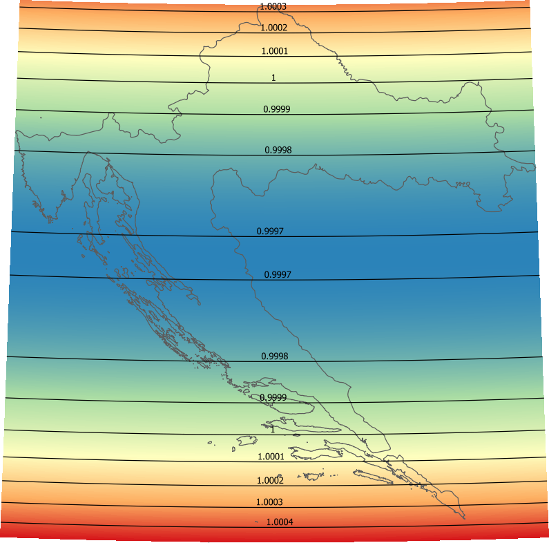

# ProjFactors
QGIS Plugin for map projections distortions visualisation

Presentation on FOSS4G Europe, Como, 2016:
https://drive.google.com/file/d/0B46kztqdEkOHQXJGd3RlUlF3NWs/view

Author: Drazen Tutic
Institution: University of Zagreb, Faculty of Geodesy
e-mail: dtutic@geof.hr
Date: 05/05/2016

Every map projection has distinct properties which are usually analysed by some factors.
PROJ4 can calculate them and print out if -V option is used.

In proj_api.h this function is not published, so standalone proj binary is used.

Available factors are:

1. Meridian scale (h or m) is linear scale along meridians. If it equals to 1, length of meridians 
is preserved and such projections are one kind of equidistant projections, e.g. normal 
aspect conic equidistant projection.

2. Parallel scale (k or n) is linear scale along parallels. If it equals to 1, length of parallels 
is preserved and such projections are one kind of equidistant projections, e.g. normal aspect 
ortographic projection.

3. Areal scale (s or p) is ratio of differential area in plane and spheroid. If it equals to 1,
projection is equiareal, e.g. cylindrical equal area projection. p = m*n*sin(theta) = a * b

4. Angular distortion (w) is maximal difference of angles in plane and spheroid in a point. 
If equals to 0, map projection is conformal, e.g. Mercator projection. m = n = a = b

5. Meridian-parallel angle (theta) is angle between mapped meridian and parallel. For example,
normal aspect cylindrical projections have theta = 90 degrees, but not all are conformal.

6. Convergence (c) is the angle from positive northing axis and tangent to meridian in a point measured positive 
clockwise. In Mercator projection convergence is 0 and bearings from map are true azimuths.

7. Maximal linear scale (a) of a point defines major axis of Tissot's indicatrix.

8. Minimal linear scale (b) of a point defines minor axis of Tissot's indicatrix.

Main purpose of this plugin is to visualize distortions, scales or angles in the active area, i.e.
over the area where data is present. This can help one to decide whether special consideration of
distortions is necessary for calculations or analysis performed with GIS operations.

Factors are calculated as raster map for project CRS which should not be geographic or geocentric.

Area for which factors are to be calculated is defined in geographic coordinates.

Some projections can't map whole spheroid. Start with smaller regions and expand as necessary.

Do not use to big raster if it is not necessary (it will take long to generate and resource problems may occur). Size of between 200 and 1000 px should be enough for most purposes.

Use inverted pseudocolor spectral palette on min-max values range with raster contour extraction operation to generate labelled isolines for even better understanding of distribution and values of distortions and scales.

